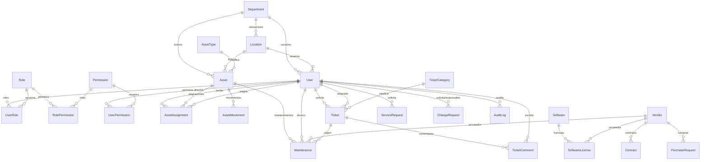

# Modelo de Datos (ERD) - TI Admin

Referencia: `docs/SPECS.md` (secciones 10, 19-27, 35-37, 39).

---

## 1. Convenciones del modelo

- PK: `Id` (int, identity).
- Todas las fechas en **UTC** (`datetime2`).
- Entidades de negocio: `CreatedAt`, `UpdatedAt`, `CreatedBy`, `UpdatedBy`.
- Entidades con historial: soft delete (`IsDeleted`, `DeletedAt`, `DeletedBy`) + **query filter** global.
- Money: `decimal(18,2)`.
- Enums persistidos como `int` (con conversión) o `string` documentado; decisión en Fase 1.
- Índices en `*Id` FKs, columnas de filtro frecuente y columnas únicas.

---

## 2. Diagrama general



---

## 3. Identity & Security

### 3.1 `Users`

```text
Id                 int            PK
UserName           nvarchar(256)
Email              nvarchar(256)  UK
PasswordHash       nvarchar(max)
SecurityStamp      nvarchar(max)
FirstName          nvarchar(100)
LastName           nvarchar(100)
EmployeeCode       nvarchar(50)   UK (nullable)
PhoneNumber        nvarchar(25)   (nullable)
DepartmentId       int            FK -> Departments
LocationId         int            FK -> Locations
JobTitle           nvarchar(100)  (nullable)
IsActive           bit            default 1
EmailConfirmed     bit            default 0
LockoutEnd         datetime2      (nullable)
AccessFailedCount  int            default 0
TwoFactorEnabled   bit            default 0
ExternalProvider   nvarchar(50)   (nullable, para Entra ID/OIDC)
ExternalId         nvarchar(128)  (nullable)
LastLoginAt        datetime2      (nullable)
CreatedAt          datetime2
UpdatedAt          datetime2
CreatedBy          int            (nullable)
UpdatedBy          int            (nullable)
IsDeleted          bit            default 0
DeletedAt          datetime2      (nullable)
DeletedBy          int            (nullable)
```

Índices: `IX_Users_Email` (unique), `IX_Users_EmployeeCode` (unique, filtered), `IX_Users_DepartmentId`, `IX_Users_IsActive`.

### 3.2 `Roles`

```text
Id            int           PK
Name          nvarchar(256) UK   -- SUPER_ADMIN, TI_ADMIN, TI_SUPPORT,
Description   nvarchar(500)      -- TI_ASSET_MANAGER, TI_MANAGER, AUDITOR, USER
IsSystemRole  bit           default 0
CreatedAt     datetime2
```

### 3.3 `Permissions`

```text
Id            int           PK
Code          nvarchar(100) UK   -- ASSETS.VIEW, TICKETS.CLOSE, ...
Module        nvarchar(50)      -- Assets, Tickets, Users, ...
Action        nvarchar(50)      -- View, Create, Update, Delete, ...
Description   nvarchar(300)
```

### 3.4 Tablas de unión

```text
UserRoles        (UserId FK, RoleId FK)      PK(UserId, RoleId)
RolePermissions  (RoleId FK, PermissionId FK) PK(RoleId, PermissionId)
UserPermissions  (UserId FK, PermissionId FK) PK(UserId, PermissionId)  -- permisos directos
```

> Justificación de `UserPermissions`: SPECS.md sección 15.2 muestra un usuario con roles **y** permisos directos.

### 3.5 Tablas Identity heredadas

`AspNetRoleClaims`, `AspNetUserClaims`, `AspNetUserLogins`, `AspNetUserRoles`, `AspNetUserTokens` (solo si se habilita el esquema Identity completo).

---

## 4. Organization

### 4.1 `Departments`

```text
Id          int          PK
Code        nvarchar(20) UK
Name        nvarchar(150) UK
Description nvarchar(500) (nullable)
ManagerId   int          FK -> Users (nullable)
ParentId    int          FK -> Departments (nullable, auto-ref)
IsActive    bit          default 1
CreatedAt   datetime2
UpdatedAt   datetime2
IsDeleted   bit          default 0
DeletedAt   datetime2    (nullable)
DeletedBy   int          (nullable)
```

### 4.2 `Locations`

```text
Id         int          PK
Code       nvarchar(20) UK
Name       nvarchar(150) UK
Address    nvarchar(300) (nullable)
City       nvarchar(100) (nullable)
Country    nvarchar(100) (nullable)
IsActive   bit          default 1
CreatedAt  datetime2
UpdatedAt  datetime2
IsDeleted  bit          default 0
DeletedAt  datetime2    (nullable)
DeletedBy  int          (nullable)
```

---

## 5. Assets

### 5.1 `AssetTypes`

```text
Id          int          PK
Code        nvarchar(30) UK   -- LAPTOP, DESKTOP, MONITOR, ...
Name        nvarchar(100) UK
Description nvarchar(300) (nullable)
IsActive    bit          default 1
```

Seed: Laptop, Desktop, Monitor, Printer, Server, Network Device, Mobile Device, UPS, Storage, Telephone, Peripheral, Other.

### 5.2 `Assets`

```text
Id                  int           PK
AssetCode           nvarchar(30)  UK
SerialNumber        nvarchar(100) UK (nullable, unique cuando no es null)
Name                nvarchar(150)
Description         nvarchar(500) (nullable)
AssetTypeId         int           FK -> AssetTypes
Brand               nvarchar(100) (nullable)
Model               nvarchar(100) (nullable)
PurchaseDate        date          (nullable)
PurchaseCost        decimal(18,2) (nullable)
WarrantyExpiration  date          (nullable)
Status              int           -- AssetStatus
CurrentUserId       int           FK -> Users (nullable, desnormalizado para consulta rápida)
LocationId          int           FK -> Locations (nullable)
DepartmentId        int           FK -> Departments (nullable)
VendorId            int           FK -> Vendors (nullable)
ParentAssetId      int           FK -> Assets (nullable, p. ej. monitor de un PC)
Notes               nvarchar(1000)(nullable)
CreatedAt           datetime2
UpdatedAt           datetime2
CreatedBy           int           (nullable)
UpdatedBy           int           (nullable)
IsDeleted           bit           default 0
DeletedAt           datetime2     (nullable)
DeletedBy           int           (nullable)
```

`Status` (`AssetStatus`): `Available=0, Assigned=1, Maintenance=2, Repair=3, Retired=4, Lost=5, Disposed=6`

Índices: `AssetCode` (unique), `SerialNumber` (unique filtered), `Status`, `AssetTypeId`, `LocationId`, `DepartmentId`, `CurrentUserId`, `WarrantyExpiration` (para alertas).

### 5.3 `AssetAssignments` (historial inmutable)

```text
Id                  int           PK
AssetId             int           FK -> Assets
UserId              int           FK -> Users
AssignmentDate      datetime2
ReturnDate          datetime2     (nullable)
AssignedById        int           FK -> Users
ReturnedById        int           FK -> Users (nullable)
ConditionAtAssignment nvarchar(500) (nullable)
ConditionAtReturn     nvarchar(500) (nullable)
Notes                 nvarchar(1000)(nullable)
IsActive             bit          default 1   -- asignación vigente
CreatedAt            datetime2
```

**Regla crítica (SPECS.md §20):** nunca se sobrescribe el historial. Al desasignar se cierra el registro actual (`ReturnDate`, `ReturnedById`, condiciones) y al reasignar se crea uno nuevo.

Índice único filtrado: `UX_AssetAssignments_AssetId_IsActive` (una sola asignación activa por activo).

### 5.4 `AssetMovements`

```text
Id         int          PK
AssetId    int          FK -> Assets
MovementType int        -- MovementType: Assignment, Return, LocationChange,
                       -- DepartmentChange, StatusChange, Transfer, Repair
FromValue  nvarchar(300) (nullable)
ToValue    nvarchar(300) (nullable)
FromLocationId int       FK -> Locations (nullable)
ToLocationId   int       FK -> Locations (nullable)
UserId      int         FK -> Users
UserName    nvarchar(256)   -- snapshot inmutable
Notes       nvarchar(1000)(nullable)
Timestamp   datetime2
CorrelationId nvarchar(64) (nullable)
```

Índice: `AssetId, Timestamp` (historial cronológico).

---

## 6. Software & Licencias

### 6.1 `Softwares`

```text
Id          int          PK
Name        nvarchar(150) UK
Publisher   nvarchar(150) (nullable)
Category    nvarchar(100) (nullable)
Description nvarchar(500) (nullable)
IsActive    bit          default 1
CreatedAt   datetime2
UpdatedAt   datetime2
IsDeleted   bit          default 0
```

### 6.2 `SoftwareLicenses`

```text
Id              int           PK
SoftwareId      int           FK -> Softwares
VendorId        int           FK -> Vendors (nullable)
ContractId      int           FK -> Contracts (nullable)
Name            nvarchar(150)             --DENormalizado para búsqueda
LicenseType     int            -- LicenseType: Perpetual, Subscription, Trial, OpenSource, OEM
LicenseKey      nvarchar(500)  (cifrado, no registrar en logs)
Quantity        int            default 0
UsedQuantity    int            default 0
PurchaseDate    date           (nullable)
ExpirationDate  date           (nullable)
Cost            decimal(18,2) (nullable)
SupportEndDate  date           (nullable)
Notes           nvarchar(1000) (nullable)
IsActive        bit            default 1
CreatedAt       datetime2
UpdatedAt       datetime2
IsDeleted       bit            default 0
DeletedAt       datetime2      (nullable)
DeletedBy       int            (nullable)
```

Checks: `CK_SoftwareLicenses_Quantity >= 0`, `CK_SoftwareLicenses_UsedQuantity >= 0 AND UsedQuantity <= Quantity`.

Índices: `ExpirationDate` (alertas), `SoftwareId`, `VendorId`.

### 6.3 `SoftwareInstallations` (opcional, para "usedQuantity" real)

```text
Id         int          PK
LicenseId  int          FK -> SoftwareLicenses
AssetId    int          FK -> Assets
UserId     int          FK -> Users (nullable)
InstalledAt datetime2
CreatedAt  datetime2
```

---

## 7. Vendors & Contracts

### 7.1 `Vendors`

```text
Id          int          PK
Code        nvarchar(20)  (nullable)
Name        nvarchar(200) UK
TaxId       nvarchar(50)  (nullable)
ContactName nvarchar(150) (nullable)
Email       nvarchar(200) (nullable)
Phone       nvarchar(30)  (nullable)
Address     nvarchar(300) (nullable)
City        nvarchar(100) (nullable)
Country     nvarchar(100) (nullable)
Website     nvarchar(200) (nullable)
Status      int           -- VendorStatus: Active, Inactive, Blocked
Notes       nvarchar(1000)(nullable)
Rating      decimal(3,2)  (nullable)
CreatedAt   datetime2
UpdatedAt   datetime2
IsDeleted   bit           default 0   -- soft delete obligatorio (§37)
DeletedAt   datetime2     (nullable)
DeletedBy   int           (nullable)
```

### 7.2 `Contracts`

```text
Id             int           PK
Number         nvarchar(50)  UK
Name           nvarchar(200)
VendorId       int           FK -> Vendors
Type           int           -- ContractType: Purchase, Service, Maintenance, Subscription, Lease, Support
StartDate      date
EndDate        date
Value          decimal(18,2)(nullable)
Currency       nvarchar(3)   default 'USD'
AutoRenew      bit           default 0
RenewalNoticeDays int        default 30
ResponsibleUserId int        FK -> Users (nullable)
Status         int           -- ContractStatus: Draft, Active, Expiring, Expired, Terminated, Renewed
Notes          nvarchar(1000)(nullable)
CreatedAt      datetime2
UpdatedAt      datetime2
IsDeleted      bit           default 0
DeletedAt      datetime2     (nullable)
DeletedBy      int           (nullable)
```

Checks: `CK_Contracts_EndDate > StartDate`.

Índice: `EndDate` (alertas 90/60/30/15/7 días, configurables).

---

## 8. Help Desk

### 8.1 `TicketCategories`

```text
Id            int          PK
Code          nvarchar(20) UK
Name          nvarchar(100) UK
Description   nvarchar(300)(nullable)
DepartmentId  int          FK -> Departments (nullable)
DefaultPriority int        -- TicketPriority
IsActive      bit          default 1
CreatedAt     datetime2
UpdatedAt     datetime2
IsDeleted     bit          default 0
```

### 8.2 `Tickets`

```text
Id             int           PK
TicketNumber   nvarchar(20)  UK   -- formato configurable, p. ej. TKT-2026-000001
Title          nvarchar(200)
Description    nvarchar(max)
CategoryId     int           FK -> TicketCategories
Priority       int           -- TicketPriority: Low=0, Medium=1, High=2, Critical=3
Status         int           -- TicketStatus: New=0, Open=1, InProgress=2, WaitingUser=3,
                             -- WaitingVendor=4, Resolved=5, Closed=6, Cancelled=7
RequesterId    int           FK -> Users
AssignedToId   int           FK -> Users (nullable)
DepartmentId   int           FK -> Departments (nullable)
AssetId        int           FK -> Assets (nullable)
ResolutionNotes nvarchar(max)(nullable)
FirstResponseAt datetime2    (nullable)   -- para medir SLA de respuesta
ResolvedAt     datetime2     (nullable)
ClosedAt       datetime2     (nullable)
DueAtResponse  datetime2     (nullable)   -- calculado desde SLA
DueAtResolution datetime2    (nullable)   -- calculado desde SLA
IsSlaBreached  bit           default 0
CreatedAt      datetime2
UpdatedAt      datetime2
CreatedBy      int           (nullable)
IsDeleted      bit           default 0
DeletedAt      datetime2     (nullable)
DeletedBy      int           (nullable)
```

Índices: `TicketNumber` (unique), `Status`, `Priority`, `AssignedToId`, `RequesterId`, `CreatedAt`, `DueAtResolution` (vencidos), `CategoryId`.

### 8.3 `TicketComments`

```text
Id         int          PK
TicketId   int          FK -> Tickets
UserId     int          FK -> Users
Content    nvarchar(max)
IsInternal bit          default 0   -- comentarios internos no visibles para el solicitante
CreatedAt  datetime2
UpdatedAt  datetime2
IsDeleted  bit          default 0
```

### 8.4 `TicketStatusHistory`

```text
Id          int          PK
TicketId    int          FK -> Tickets
FromStatus  int          (nullable)
ToStatus    int
UserId      int          FK -> Users
UserName    nvarchar(256)   -- snapshot
Comment     nvarchar(500)(nullable)
Timestamp   datetime2
```

Índice: `TicketId, Timestamp`.

### 8.5 `ServiceRequests`

```text
Id            int          PK
RequestNumber nvarchar(20) UK
Title         nvarchar(200)
Description   nvarchar(max)
RequestTypeId int          FK -> RequestTypes
Priority      int
Status        int          -- ServiceRequestStatus
RequesterId   int          FK -> Users
AssignedToId  int          FK -> Users (nullable)
DepartmentId  int          FK -> Departments (nullable)
NeededByDate  date         (nullable)
ApprovalStatus int         -- Pending, Approved, Rejected
ApprovedById  int          FK -> Users (nullable)
ApprovedAt    datetime2    (nullable)
CreatedAt     datetime2
UpdatedAt     datetime2
FulfilledAt   datetime2    (nullable)
IsDeleted     bit          default 0
```

### 8.6 `RequestTypes`

```text
Id          int          PK
Code        nvarchar(20) UK
Name        nvarchar(150) UK
Description nvarchar(500)(nullable)
RequiresApproval bit      default 0
IsActive    bit          default 1
```

---

## 9. SLA

### 9.1 `SlaConfigurations`

```text
Id                  int          PK
Name                nvarchar(100) UK
CategoryId          int          FK -> TicketCategories (nullable)
Priority            int          (nullable)   -- null = todas
RequestTypeId       int          FK -> RequestTypes (nullable)
DepartmentId        int          FK -> Departments (nullable)
ResponseTimeMinutes int          not null
ResolutionTimeMinutes int        not null
BusinessHoursOnly   bit          default 1
WorkStartTime       time         default '08:00'
WorkEndTime         time         default '17:00'
WorkDays            nvarchar(20) default '1,2,3,4,5'   -- L,M,X,J,V
IsDefault           bit          default 0
CreatedAt           datetime2
UpdatedAt           datetime2
IsDeleted           bit          default 0
```

Checks: `ResponseTimeMinutes > 0`, `ResolutionTimeMinutes > 0`, `WorkEndTime > WorkStartTime`.

> Horarios de trabajo se muestran en la zona horaria de la organización (`America/Managua`).

### 9.2 `BusinessCalendars` (opcional, feriados)

```text
Id        int          PK
Date      date         UK
Name      nvarchar(150)
Country   nvarchar(100) default 'NI'
IsWorkingDay bit       default 0
```

---

## 10. Mantenimientos

### 10.1 `Maintenances`

```text
Id              int           PK
MaintenanceNumber nvarchar(20) UK
Title           nvarchar(200)
Description     nvarchar(max) (nullable)
Type            int           -- MaintenanceType: Preventive=0, Corrective=1, Emergency=2
Status          int           -- MaintenanceStatus: Planned=0, Scheduled=1, InProgress=2,
                             -- Completed=3, Cancelled=4
AssetId         int           FK -> Assets
TechnicianId    int           FK -> Users (nullable)
VendorId        int           FK -> Vendors (nullable)
TicketId        int           FK -> Tickets (nullable)
ContractId      int           FK -> Contracts (nullable)
ScheduledDate   datetime2
StartedAt       datetime2     (nullable)
CompletedAt     datetime2     (nullable)
NextDueDate     datetime2     (nullable)   -- para preventivo
EstimatedCost   decimal(18,2)(nullable)
ActualCost      decimal(18,2)(nullable)
Findings        nvarchar(max) (nullable)
Actions         nvarchar(max) (nullable)
Recommendations nvarchar(max) (nullable)
CreatedAt       datetime2
UpdatedAt       datetime2
CreatedBy       int           (nullable)
IsDeleted       bit           default 0
```

Índices: `AssetId`, `Status`, `ScheduledDate`, `NextDueDate`, `Type`.

---

## 11. Change Management

### 11.1 `ChangeRequests`

```text
Id                 int           PK
Number             nvarchar(20)  UK
Title              nvarchar(200)
Description        nvarchar(max)
Type               int           -- ChangeType: Standard, Normal, Emergency
Risk               int           -- ChangeRisk: Low, Medium, High
Impact             int           -- ChangeImpact: Low, Medium, High
Status             int           -- ChangeStatus: Draft=0, Requested=1, UnderReview=2, Approved=3,
                                 -- Rejected=4, Implementing=5, Completed=6, RolledBack=7, Closed=8
RequestedById      int           FK -> Users
AssignedToId       int           FK -> Users (nullable)
DepartmentId       int           FK -> Departments (nullable)
AssetId            int           FK -> Assets (nullable)
PlannedDate        datetime2     (nullable)
ImplementationDate datetime2     (nullable)
RollbackPlan       nvarchar(max) (nullable)
ApprovedById       int           FK -> Users (nullable)
ApprovedAt         datetime2     (nullable)
RejectionReason    nvarchar(1000)(nullable)
CompletedAt        datetime2     (nullable)
ClosedAt           datetime2     (nullable)
CreatedAt          datetime2
UpdatedAt          datetime2
IsDeleted          bit           default 0
```

---

## 12. Compras

### 12.1 `PurchaseRequests`

```text
Id            int           PK
Number        nvarchar(20)  UK
Title         nvarchar(200)
Description   nvarchar(max) (nullable)
Status        int           -- PurchaseStatus: Draft, Submitted, Approved, Rejected, Ordered, Received, Cancelled
RequestedById int           FK -> Users
DepartmentId  int           FK -> Departments (nullable)
VendorId      int           FK -> Vendors (nullable)
Justification nvarchar(max) (nullable)
EstimatedCost decimal(18,2)(nullable)
RequestedDate date
NeededDate    date          (nullable)
ApprovedById  int           FK -> Users (nullable)
ApprovedAt    datetime2     (nullable)
OrderedAt     datetime2     (nullable)
ReceivedAt    datetime2     (nullable)
CreatedAt     datetime2
UpdatedAt     datetime2
IsDeleted     bit           default 0
```

### 12.2 `PurchaseItems`

```text
Id                  int           PK
PurchaseRequestId   int           FK -> PurchaseRequests
Description         nvarchar(300)
Quantity            int           default 1
UnitPrice           decimal(18,2)
TotalPrice          decimal(18,2)
AssetTypeId         int           FK -> AssetTypes (nullable)
VendorId            int           FK -> Vendors (nullable)
Notes               nvarchar(500) (nullable)
```

---

## 13. Documentos

### 13.1 `Documents`

```text
Id          int          PK
FileName    nvarchar(300)
StoragePath nvarchar(500)   -- ruta relativa en File Storage (el binario NO está en la BD)
MimeType    nvarchar(150)
Size        bigint
Checksum    nvarchar(128)   (nullable, SHA256)
EntityName  nvarchar(100)   -- "Asset", "Ticket", "Contract", "License", "ChangeRequest", "Maintenance"
EntityId    int
Description nvarchar(500)   (nullable)
Category    nvarchar(100)   (nullable)
UploadedById int           FK -> Users
UploadedAt  datetime2
IsDeleted   bit           default 0
DeletedAt   datetime2     (nullable)
DeletedById int           (nullable)
```

Índice: `EntityName, EntityId`.

---

## 14. Auditoría

### 14.1 `AuditLogs`

```text
Id            bigint       PK (identity)
UserId        int          FK -> Users (nullable)
UserName      nvarchar(256)  -- snapshot (nullable si fue system)
Action        nvarchar(50)    -- CREATE, UPDATE, DELETE, LOGIN, LOGOUT, EXPORT, ACCESS_DENIED...
EntityName    nvarchar(100)
EntityId      nvarchar(64)
OldValues     nvarchar(max) (JSON)
NewValues     nvarchar(max) (JSON)
IpAddress     nvarchar(45) (IPv6 safe)
UserAgent     nvarchar(500)(nullable)
Timestamp     datetime2
CorrelationId nvarchar(64) (nullable)
Severity      nvarchar(20)    -- Info, Warning, Error
Module        nvarchar(50)    -- Assets, Tickets, Users, ...
```

Índices: `UserId`, `EntityName+EntityId`, `Timestamp`, `Action`, `CorrelationId`.

> **Solo lectura**: la API de auditoría no expone PUT/PATCH/DELETE para roles normales.

---

## 15. Configuración

### 15.1 `SystemConfigurations`

```text
Id           int           PK
Key          nvarchar(150) UK
Value        nvarchar(max)  (nullable)
DefaultValue nvarchar(max)  (nullable)
Group        nvarchar(50)   -- General, Localization, Sla, Alerts, Security, Email, Storage
DataType     nvarchar(20)   -- String, Int, Bool, Date, Json, Encrypted
Description  nvarchar(500) (nullable)
IsPublic     bit           default 0   -- expuesto a configuración del frontend
IsEditable   bit           default 1
UpdatedById  int           FK -> Users (nullable)
UpdatedAt    datetime2
```

Claves iniciales:

| Key | Default | Descripción |
|---|---|---|
| `App.TimeZone` | `America/Managua` | Zona horaria de presentación |
| `App.Name` | `TI Admin` | Nombre visible |
| `App.PageSize` | `25` | Tamaño de página por defecto |
| `App.MaxPageSize` | `200` | Tamaño máximo de página |
| `Sla.Default.ResponseMinutes` | `240` | SLA respuesta por defecto |
| `Sla.Default.ResolutionMinutes` | `1440` | SLA resolución por defecto |
| `Alerts.Contract.Days` | `90,60,30,15,7` | Días de alerta de contratos |
| `Alerts.License.Days` | `90,30,14,7` | Días de alerta de licencias |
| `Alerts.Maintenance.Days` | `7` | Días de recordatorio de mantenimiento |
| `Storage.RootPath` | `./storage` | Ruta raíz de File Storage |

---

## 16. Notificaciones

### 16.1 `Notifications`

```text
Id        int          PK
UserId    int          FK -> Users
Type      nvarchar(50)    -- TicketAssigned, LicenseExpiring, ContractExpiring, ...
Title     nvarchar(200)
Message   nvarchar(max)
Link      nvarchar(300) (nullable)
EntityName nvarchar(100)(nullable)
EntityId  int           (nullable)
IsRead    bit          default 0
ReadAt    datetime2    (nullable)
CreatedAt datetime2
```

Índice: `UserId, IsRead, CreatedAt`.

---

## 17. Resumen de cardinalidades

| Relación | Cardinalidad | OnDelete |
|---|---|---|
| Department → User | 1:N | Restrict |
| Location → Asset | 1:N | Restrict |
| Asset → AssetAssignment | 1:N | Restrict |
| Asset → AssetAssignment (activa) | 1:1 (unique filtered) | — |
| User → AssetAssignment | 1:N | Restrict |
| AssetType → Asset | 1:N | Restrict |
| Asset → Maintenance | 1:N | Restrict |
| Software → SoftwareLicense | 1:N | Restrict |
| Vendor → Contract | 1:N | Restrict |
| Vendor → SoftwareLicense | 1:N | Restrict |
| TicketCategory → Ticket | 1:N | Restrict |
| Ticket → TicketComment | 1:N | Cascade (comments no tienen valor aislado) |
| User → Ticket (requester) | 1:N | Restrict |

**Política general:** `Restrict` por defecto. Se usa `Cascade` solo en tablas hijas sin valor propio (comments, items, uniones).

---

## 18. Índices compuestos recomendados

```text
IX_Tickets_Status_CreatedAt            (Status, CreatedAt DESC)
IX_Tickets_AssignedToId_Status         (AssignedToId, Status)
IX_Tickets_DueAtResolution_Status      (DueAtResolution, Status)
IX_Assets_Status_LocationId             (Status, LocationId)
IX_Assets_AssetTypeId_Status           (AssetTypeId, Status)
IX_AssetAssignments_AssetId_AssignmentDate (AssetId, AssignmentDate DESC)
IX_SoftwareLicenses_ExpirationDate_IsActive (ExpirationDate, IsActive)
IX_Contracts_EndDate_Status            (EndDate, Status)
IX_Maintenances_NextDueDate_Status      (NextDueDate, Status)
IX_AuditLogs_Timestamp_EntityName      (Timestamp DESC, EntityName)
UX_TicketCategories_Code               unique
UX_Roles_Name                          unique
UX_Permissions_Code                    unique
UX_AssetTypes_Code                      unique
```

---

## 19. Pendiente de definir en Fase 1

| ID | Tema | Estado |
|---|---|---|
| Q-06 | Persistencia de enums: `int` vs `string` | Pendiente |
| Q-07 | ¿`Tickets` y `ServiceRequests` se unifican en una sola entidad? | Pendiente |
| Q-08 | Convenciones de numeración (`TicketNumber`, `ContractNumber`) | Pendiente |
| Q-09 | Cifrado de `SoftwareLicense.LicenseKey` (Data Protection vs SQL Always Encrypted) | Pendiente |
| Q-10 | ¿`Notifications` requiere FK a entidad polimórfica? (opcional, ya reservados como columnas) | Pendiente |
